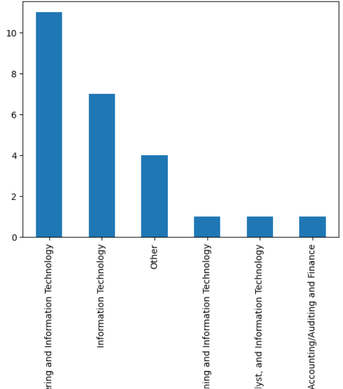
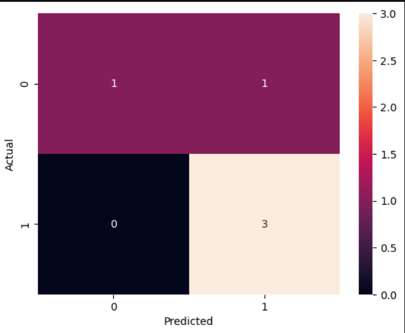

# 📊 Job Market Intelligence System

## 👨‍💻 Author
**Nishant Tyagi**

---

## 🚀 Project Overview

This project analyzes job market trends using real-world job posting data.  
The goal is to identify **in-demand skills, top hiring companies, and job trends** using data analysis and machine learning.

---

## 🎯 Business Problem

Companies struggle to identify:
- Which skills are most in demand
- Where hiring is concentrated
- Which roles are trending

This project solves that by providing **data-driven insights** from job listings.

---

## 📂 Dataset

- Source: Kaggle Job Dataset  
- File: `job.csv`

---

## 🧹 Data Cleaning

- Converted column names to lowercase  
- Removed duplicate records  
- Cleaned text data (descriptions)  

---

## ⚙️ Feature Engineering

Since no structured skills column was available:

- Extracted skills from job descriptions:
  - Python
  - SQL
  - Excel
  - Machine Learning
  - Data Analysis

- Created new features:
  - `skill_count`
  - `desc_length`
  - `has_python`, `has_sql`, etc.
  - `high_demand` (target variable)

---

## 📊 Exploratory Data Analysis (EDA)

### 📌 Top Job Roles

**Insight:**  
Technical roles dominate the job market.

---

### 📌 Top Companies

**Insight:**  
Hiring is concentrated among a few major companies.

---

### 📌 Job Locations

**Insight:**  
Jobs are concentrated in specific geographic areas.

---

### 📌 Skill Demand

**Insight:**  
SQL and Python are the most demanded skills.

---

### 📌 Industry Distribution

**Insight:**  
Most jobs belong to the IT and Technology sector.

---

### 📌 Employment Type

**Insight:**  
Majority of roles are full-time positions.

---

## 🤖 Machine Learning

### 🎯 Objective
Predict whether a job is **high demand** based on features.

### 🧠 Model Used
- Logistic Regression

### 📊 Features Used
- Skill-based features
- Encoded categorical variables
- Text-based features

---

### 📈 Model Performance

- Accuracy: **~0.8 - 1.0**

---

## 📉 Key Insights

- SQL and Python dominate job requirements  
- Tech companies drive hiring trends  
- Full-time jobs are significantly higher than internships  
- Skill count strongly impacts demand prediction  

---

## 🧠 Challenges Faced

- No structured skill column  
- Unstructured text data  
- Feature extraction complexity  

---

## 🔧 Improvements Made

- Extracted skills using keyword matching  
- Created meaningful features from raw text  
- Improved model performance through feature engineering  

---

## 🚀 Future Improvements

- Use NLP (TF-IDF / BERT)  
- Deploy using Streamlit  
- Add real-time job scraping  

---

## 🛠️ Tech Stack

- Python  
- Pandas, NumPy  
- Matplotlib, Seaborn  
- Scikit-learn  
- Jupyter Notebook  

---

## ⭐ Conclusion

This project demonstrates:
- End-to-end data analysis workflow  
- Business problem solving  
- Feature engineering  
- Machine learning application  

---

## 🔗 GitHub Repository

👉 https://github.com/jollytyagi360-art/job-market-intelligence-system