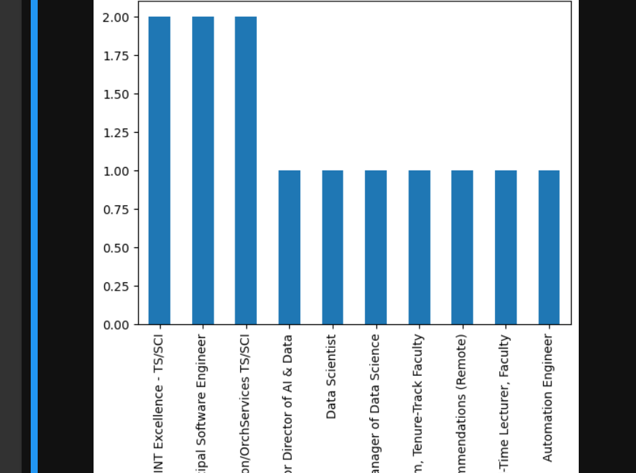
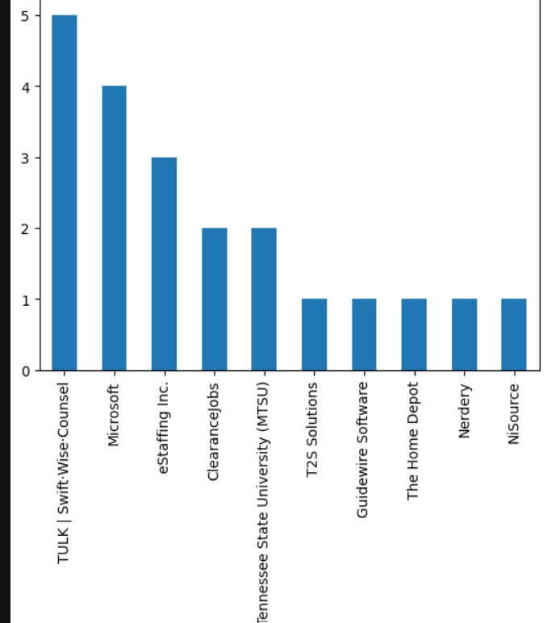
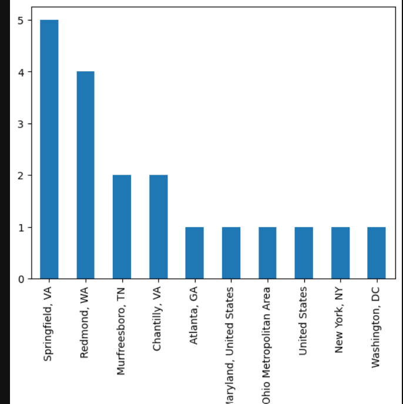
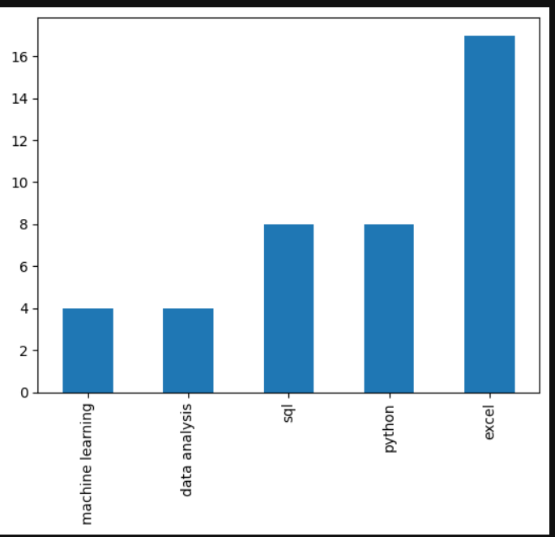
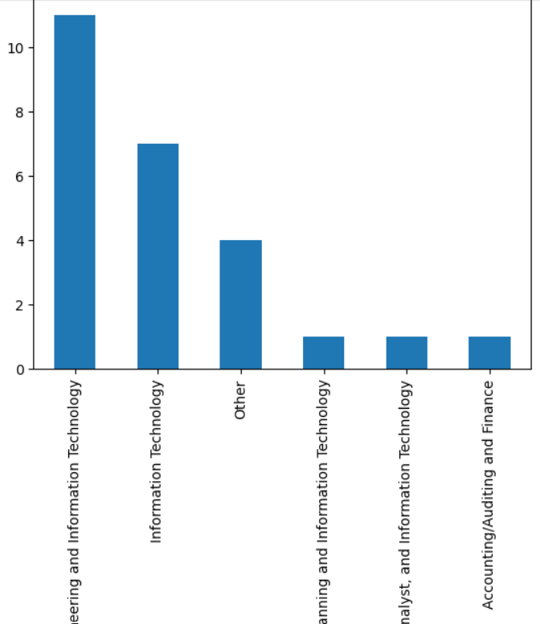
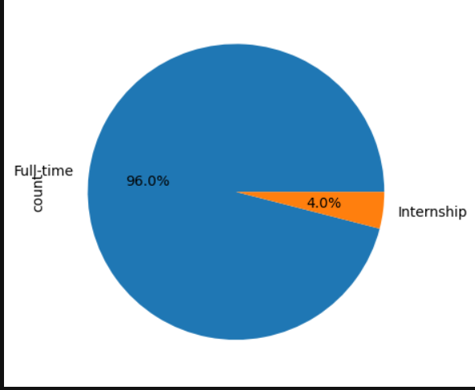
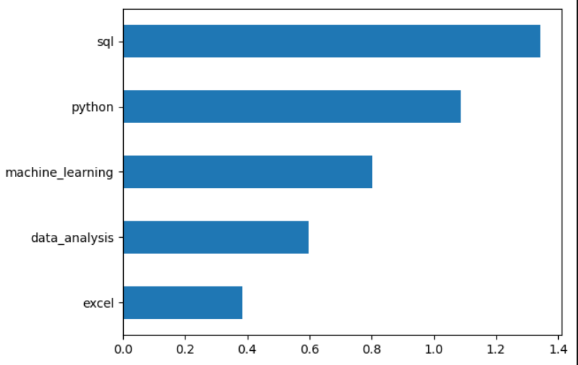

# 📊 Job Market Intelligence System

**Author:** Nishant Tyagi

---

## 📌 Overview

This project analyzes job listings data to understand hiring trends, identify in-demand skills, and build a machine learning model to classify high-demand jobs.

The main focus is on extracting insights from unstructured job descriptions and converting them into structured features for analysis.

---

## 🎯 Problem Statement

Many candidates struggle to identify which skills are actually required in the job market. This leads to confusion and inefficient preparation.

This project aims to analyze job listings and uncover patterns in skill demand and hiring trends.

---

## 🛠️ Approach

### 🔹 1. Data Understanding

* Dataset contains job listings with title, company, location, and description
* No structured skills column available

---

### 🔹 2. Data Cleaning

* Converted column names to lowercase
* Removed duplicate records
* Cleaned textual data

---

### 🔹 3. Exploratory Data Analysis (EDA)

#### 📊 Top Job Roles



**Insight:**
Technical roles dominate the job market.

---

#### 📊 Top Companies



**Insight:**
Hiring is concentrated among a few companies.

---

#### 📊 Job Locations



**Insight:**
Jobs are concentrated in specific geographic areas.

---

#### 📊 Skill Demand



**Insight:**
SQL and Python are the most demanded skills.

---

#### 📊 Industry Distribution



**Insight:**
Most jobs belong to the technology sector.

---

#### 📊 Employment Type



**Insight:**
Full-time roles dominate (~96%).

---

---

## 🔥 Challenges & Learnings

### ❌ Missing Salary Column

* Initially expected salary data
* Adjusted approach to focus on skills and demand

---

### ❌ No Structured Skills

* Extracted skills from description using keyword matching

---

### ❌ Data Leakage Issue

* Used `skill_count` in both target and features
* Resulted in 100% accuracy

👉 Fixed by removing dependent features

---

### ❌ Execution Order Issue

* Model trained before target creation
* Fixed pipeline order

---

---

## ⚙️ Feature Engineering

* Extracted skills:

  * Python
  * SQL
  * Excel
  * Machine Learning
  * Data Analysis

* Created:

  * Binary skill indicators
  * Derived features for ML

---

## 🤖 Machine Learning Model

* Model: Logistic Regression
* Task: Binary classification (high-demand jobs)

---

### 📊 Model Evaluation



---

## 📈 Results

* Accuracy: **~80%**
* Model performs well without overfitting

---

## 💡 Key Insights

* SQL is the most demanded skill
* Python is second most important
* Skill combinations influence job demand
* Most jobs are full-time
* Technology dominates hiring

---

## 🚀 Tech Stack

* Python
* Pandas, NumPy
* Matplotlib, Seaborn
* Scikit-learn

---

## 📂 Project Structure

```
job-market-intelligence-system/
│
├── data/
├── notebooks/
├── outputs/
├── README.md
```

---

## 🔚 Conclusion

This project shows how unstructured job data can be transformed into meaningful insights and predictive models.

It highlights the importance of:

* Proper feature engineering
* Avoiding data leakage
* Understanding real-world data limitations

---

## 📌 Future Improvements

* Add salary-based analysis
* Improve NLP techniques
* Build deployment app
